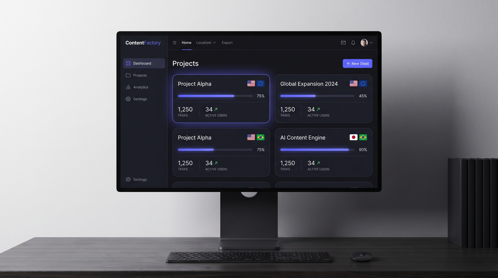
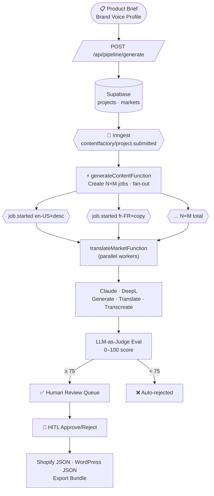

# ContentFactory

> Multi-market AI content production pipeline — from product brief to platform-ready copy in 12 languages.

> **Portfolio demo.** All product briefs, brand names, customer references, and URLs in this repo are fictional. The pipeline architecture, code, and fixtures demonstrate the system — they are not tied to any real company or product.

[](https://www.typescriptlang.org/)
[](https://nextjs.org/)
[](https://www.inngest.com/)
[](https://supabase.com/)
[](https://vercel.com/)
[](./LICENSE)

<br />



<br />

---

## What it does

ContentFactory accepts a **product brief** and **brand voice profile**, then fans out across up to **12 markets in parallel** to produce localised, platform-ready marketing copy.

Each output goes through a full quality pipeline before it ever reaches a human reviewer:

```
Product Brief
     │
     ▼
Claude (EN-US generation)
     │
     ├─── DeepL  ──────────────────┐
     │                             ▼
     └───────────────── Claude Transcreation (cultural adaptation)
                                   │
                              Back-translation QA
                              (keyword overlap < 40% = flag)
                                   │
                              LLM-as-Judge Eval
                              (tone · brand voice · cultural · hallucination)
                                   │
                    ┌─────score ≥ 75──────┐
                    ▼                     ▼
             Human Review Queue      Auto-rejected
                    │
              Approve / Reject
                    │
           Shopify JSON  ·  WordPress/WPML JSON  ·  Export bundle
```

---

## Features

| Feature | Detail |
|---|---|
| **12 locale support** | en-US, en-GB, fr-FR, fr-CA, es-ES, es-MX, de-DE, it-IT, pt-BR, nl-NL, pl-PL, ja-JP |
| **4 content types** | Product descriptions · Ad copy · Meta tags · Landing page copy |
| **3 translation modes** | `deepl` · `claude` · `both` (MT draft → Claude refine) |
| **Inngest fan-out** | N locales × M content types jobs run fully in parallel |
| **Back-translation QA** | Keyword overlap ratio detects semantic drift without an NLP service |
| **LLM-as-Judge eval** | 0–100 score across tone, brand voice, cultural accuracy, hallucination |
| **HITL review queue** | SLA-coloured review cards (green <24h · amber 24-48h · red >48h) |
| **Fixture mode** | All adapters have fixture implementations — zero API keys to run locally |
| **Shopify output** | `product.metafields` + `shopify_translation` adapter-shaped JSON |
| **WordPress output** | Post body · Yoast SEO meta · WPML `hreflang` map |
| **Eval analytics** | Recharts radar + bar charts aggregated by locale and content type |
| **Export bundle** | Single-click project export as structured JSON |

---

## Architecture



Full diagram with DB schema: [`docs/diagrams/architecture.mmd`](./docs/diagrams/architecture.mmd)

---

## Stack

| Layer | Technology |
|---|---|
| Framework | Next.js 16 · React 19 · TypeScript (strict + `noUncheckedIndexedAccess`) |
| Styling | Tailwind v4 · shadcn/ui (new-york) · always-dark design system |
| AI generation | Claude API via Vercel AI Gateway (`gateway('anthropic/claude-opus-4-7')`) |
| Translation | DeepL API + Claude transcreation layer |
| Orchestration | Inngest (event fan-out, automatic retries, DLQ) |
| Database | Supabase (PostgreSQL + Row Level Security) |
| Eval | LLM-as-Judge harness (AI SDK `generateObject` with Zod schema) |
| Charts | Recharts (RadarChart · BarChart) |
| Deployment | Vercel (Fluid Compute) |

---

## Quick start (fixture mode — no API keys required)

```bash
git clone https://github.com/RexOwenDev/content-factory
cd content-factory
pnpm install
cp .env.example .env.local       # fill Supabase + Inngest keys only
pnpm db:migrate                  # apply Supabase migrations
pnpm db:seed                     # seed 3 demo projects
pnpm dev
```

Open [http://localhost:3000](http://localhost:3000).

All Claude, DeepL, and eval calls run from [`fixtures/`](./fixtures/) — no AI API keys needed to explore the full dashboard and review queue.

---

## Go live

Set these in `.env.local` to switch from fixtures to real API calls:

```env
ADAPTER_MODE=live

# AI generation
ANTHROPIC_API_KEY=sk-ant-...
# or via Vercel AI Gateway (recommended on Vercel):
# VERCEL_AI_GATEWAY_URL and VERCEL_AI_GATEWAY_TOKEN set automatically

# Translation
DEEPL_API_KEY=...

# Orchestration
INNGEST_SIGNING_KEY=signkey-prod-...
INNGEST_EVENT_KEY=...
```

See [SETUP.md](./SETUP.md) for the full setup guide including Supabase schema, webhook configuration, and Inngest registration.

---

## Demo projects

The seed script populates three showcase projects:

| Project | Markets | Content types |
|---|---|---|
| **ForgeTorque Pro 3000** (power tools) | 🇺🇸 🇬🇧 🇫🇷 🇩🇪 🇯🇵 | Product desc · Ad copy · Meta tags · Landing page |
| **LuxDermis Advanced Serum** (beauty) | 🇺🇸 🇫🇷 🇩🇪 🇯🇵 | Product desc · Ad copy · Meta tags |
| **VeloCargo Urban Bike** (e-commerce) | 🇺🇸 🇫🇷 🇩🇪 🇳🇱 | Product desc · Ad copy · Landing page |

```bash
pnpm db:seed   # creates all three with outputs and eval scores pre-populated
```

---

## Project structure

```
src/
  app/
    (dashboard)/          # Projects · Project detail · Review queue · Eval · Analytics
    api/
      pipeline/generate/  # POST — fires Inngest event
      projects/[id]/      # outputs · eval-summary · reviews · export
      reviews/[reviewId]/ # PATCH approve/reject
      inngest/            # Inngest serve() handler
  components/
    dashboard/            # ProjectCard · ProjectTabs · StatsRow
    pipeline/             # RunPipelineButton · PipelineStatus
    output/               # OutputViewer · ExportButton
    eval/                 # EvalAnalytics (Recharts)
    review/               # ReviewCard (HITL)
  lib/
    adapters/             # claude · deepl · shopify · wordpress (fixture + live)
    pipeline/             # prompts.ts
    inngest/
      functions/          # generateContent · translateMarket
    db/
      queries/            # projects · jobs · outputs · reviews
fixtures/
  briefs/                 # 3 product briefs
  generated/              # EN-US source content
  transcreated/           # Locale-specific transcreations
  evaluated/              # Eval score fixtures
  shopify/ wordpress/     # Platform output shapes
docs/
  diagrams/architecture.mmd
  PROJECT-MEMORY.md
scripts/
  seed-demo.ts
```

---

## Phases

| Phase | Status |
|---|---|
| 0 — Foundation & Scaffolding | ✅ |
| 1 — Brief Ingestion & Market Matrix | ✅ |
| 2 — AI Content Generation Core | ✅ |
| 3 — Translation & Transcreation | ✅ |
| 4 — Quality & Eval Harness | ✅ |
| 5 — Review Queue & HITL | ✅ |
| 6 — Output Shaping & Integration | ✅ |
| 7 — Dashboard, Analytics & Polish | ✅ |
| 8 — Docs, Visuals & Launch | ✅ |

---

## License

MIT — see [LICENSE](./LICENSE)
